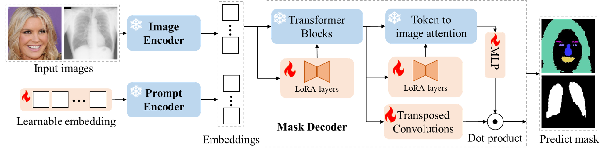

# MetaTune

This repository contains the code, data-preparation scripts, hyperparameters, and reproduction recipes for the paper:

> **Meta-Finetuning Foundation Models for Generalizable Biological Image Segmentation in Ultra Low-Data Regimes**
> Li Zhang, Youwei Liang, Phuc Nguyen, Fanny Chapelin, Nan Hao, Pengtao Xie
> Manuscript no. CR-METHODS-D-26-00020 (*Cell Reports Methods*, under review)

## Overview



MetaTune adapts the Segment Anything Model (SAM) for biological image segmentation under ultra-low-data conditions. The trainable parameters of a LoRA-adapted SAM mask decoder are partitioned into two groups — **meta** parameters (the learnable prompt embedding) and **non-meta** parameters (the LoRA layers and transposed convolutions) — and updated via a two-stage bilevel optimization that alternates between task-specific adaptation on one subset of supports and generalization tuning on a held-out subset.

> **Methodological lineage.** The bilevel-optimization framework underlying MetaTune was introduced as **BLO-SAM** (Zhang et al., *ICML 2024*) for natural-image segmentation. The contribution of this paper is to (i) apply that framework to biological image segmentation in ultra-low-data regimes, (ii) benchmark it across eight diverse biological datasets and an in-distribution / out-of-distribution split on yeast cell segmentation, and (iii) explore extensions of the framework to instance segmentation through combinations with Cellpose-SAM and a YOLOv7+SAM-bilevel pipeline.

## Repository layout

```
.
├── train.py / train_vanilla.py / train_instance.py    Training entry points (bilevel / joint / instance-seg)
├── trainer.py / trainer_vanilla.py / trainer_instance.py   Training loops
├── prompt.py                                          Bilevel optimization (DARTS-style)
├── inference.py / inference_instance.py   Evaluation
├── sam_lora_mask_decoder.py                           Default LoRA-adapted SAM
├── sam_lora_mask_decoder_instance.py                  Extension: Cellpose-style flow head
├── sam_lora_image_encoder.py / sam_lora_prompt_encoder.py / sam_lora_all.py   Other LoRA placements
├── datasets/                                          Four dataset loaders plus package initialization
├── baselines/                                         Wrappers for all comparison methods
├── third_party/yolov7_sam/                          Vendored YOLOv7+SAM training source
│   ├── persam_f_samed.py                              PerSAM-F (Zhang et al., ICLR 2024) adapter
│   ├── matcher_samed.py                               Matcher (Liu et al., ICLR 2024) adapter
│   ├── cellpose_samed.py                              Cellpose / Cellpose-SAM fine-tune adapter
│   ├── stardist_samed.py                              StarDist (Schmidt et al., MICCAI 2018) adapter
│   ├── cellpose_cpsam_bilevel.py                      Our cpsam + BLO-SAM-bilevel hybrid
│   ├── blosam_amg.py                                  SAM AutoMaskGenerator on BLO-SAM backbone
│   ├── regen_cytonuke_instances.py                    Convert CytoNuke COCO -> per-pixel instance masks
│   ├── regen_fluored_instances.py                     Convert FluoRed COCO -> per-pixel instance masks
│   ├── instance_to_yolo.py                            Convert instance masks -> YOLO polygon labels
│   ├── sample_yolo_nshot.py                           Sample N-shot YOLO splits with seeds
│   └── aggregate_persam.py                            Aggregator for baseline sweeps
├── scripts/                                           Shell scripts that drive full sweeps
├── train.sh / inference.sh / train_swap.sh            Single-run shell wrappers
├── infer_swap.sh                                      Test-set inference for swap-meta ablation
├── environment.yml / environment-stardist.yml         Reproducible conda envs
├── REPRODUCE.md                                       Per-figure / per-table reproduction recipes
├── DATA.md                                            Dataset sources, licenses, preprocessing
├── HYPERPARAMETERS.md                                 Per-task hyperparameter tables
└── HARDWARE.md                                        Hardware, CUDA, runtime characterization
```

## Quick start

### 1. Set up the environment

```bash
conda env create -f environment.yml         # main env: torch 2.5.1+cu121 + most baselines
conda activate metatune
# StarDist needs its own env (TensorFlow conflicts with torch's cu121 NVIDIA libs):
conda env create -f environment-stardist.yml
```

### 2. Download SAM-ViT-B weights

Place `sam_vit_b_01ec64.pth` in a checkpoints directory and update the `--ckpt` flag in `train.sh` / `inference.sh`:

```bash
wget -O sam_vit_b_01ec64.pth https://dl.fbaipublicfiles.com/segment_anything/sam_vit_b_01ec64.pth
```

### 3. Prepare a dataset

For example, the BCCD blood-cell segmentation dataset:

```bash
# train images at: $DATA_ROOT/blood-cell/train/Images/*.png  (with /Masks/*.png siblings)
# test images at:  $DATA_ROOT/blood-cell/test/Images/*.png   (with /Masks/*.png siblings)
```

See [DATA.md](DATA.md) for source URLs and preprocessing for all eight biological datasets used in the paper.

### 4. Train MetaTune

```bash
bash train.sh
```

Set `TRAIN_IMAGES`, `DATASET`, `BASE_LR`, and `PROMPT_LR` as shown in [REPRODUCE.md](REPRODUCE.md); no script editing is required.

### 5. Evaluate

```bash
bash inference.sh
```

### 6. Reproduce paper results

See [REPRODUCE.md](REPRODUCE.md) for commands mapped to Figures 1–7 and Supplementary Figures S1–S11. The previously referenced `figures.ipynb` is not part of this repository, so the guide no longer depends on it.

## Reproducibility checklist

This repository was prepared following the community checklist of Schmied et al. (*Nat Methods*, 2024) for publishing image analyses:

- **Code**: MetaTune and the included adapters are shipped here; externally implemented comparison methods and their documented limitations are listed in `REPRODUCE.md`.
- **Weights**: trained checkpoints for all reported MetaTune (semantic) and ablation runs (vanilla baseline + swap-meta) are deposited on Zenodo: [10.5281/zenodo.20517421](https://doi.org/10.5281/zenodo.20517421).
- **Data**: source URLs, licenses, preprocessing scripts, and train/test splits are documented in [DATA.md](DATA.md).
- **Hyperparameters**: per-task, per-method, per-seed hyperparameters are tabulated in [HYPERPARAMETERS.md](HYPERPARAMETERS.md), and the exact `config.txt` from every reported run is bundled with the released checkpoints on Zenodo.
- **Hardware / software**: documented in [HARDWARE.md](HARDWARE.md). Dependencies are declared in `environment.yml` and `environment-stardist.yml`.
- **Seeds**: all randomized experiments use seeds `{42, 40, 22}` (and `42` for single-seed smoke tests). The seed used to sample support images, initialize the network, and shuffle data is documented in `config.txt` of each run.

## License

MIT — see the [LICENSE](LICENSE) for details.

## Acknowledgements

We acknowledge:
- [Segment Anything Model](https://github.com/facebookresearch/segment-anything) (Kirillov et al., 2023).
- [SAM-LoRA](https://github.com/JamesQFreeman/Sam_LoRA) and [SAMed](https://github.com/hitachinsk/SAMed) for the LoRA-adapted SAM scaffolding.
- [BLO-SAM](https://github.com/importZL/BLO-SAM) (Zhang et al., ICML 2024) — the bilevel-optimization framework that MetaTune builds upon.
- [Cellpose / Cellpose-SAM](https://github.com/MouseLand/cellpose) (Stringer & Pachitariu) for the instance-segmentation baselines and metrics.
- [StarDist](https://github.com/stardist/stardist) (Schmidt et al., 2018) as an instance-segmentation baseline.
- [Matcher](https://github.com/aim-uofa/Matcher) (Liu et al., ICLR 2024) and [PerSAM](https://github.com/ZrrSkywalker/Personalize-SAM) (Zhang et al., ICLR 2024) as few-shot SAM baselines.
- All eight biological-dataset providers (see [DATA.md](DATA.md) for individual citations and links).

